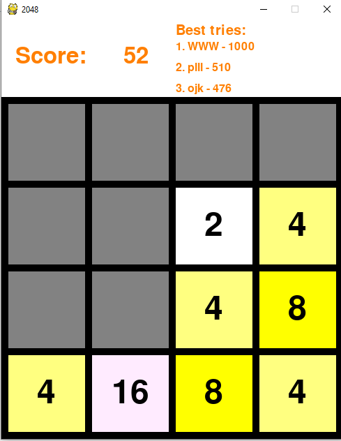

# 2048 
This is a console game, a copy of the famous game 2048

## Requirements 

1. Git clone https://github.com/imaevam/2048.git
2. Create virtual environment 
3. Install  all its dependencies:

``` pip3 install -r requirements.txt ```


## Run
You can play 2048 with arrow key:

``` python3 main.py```

